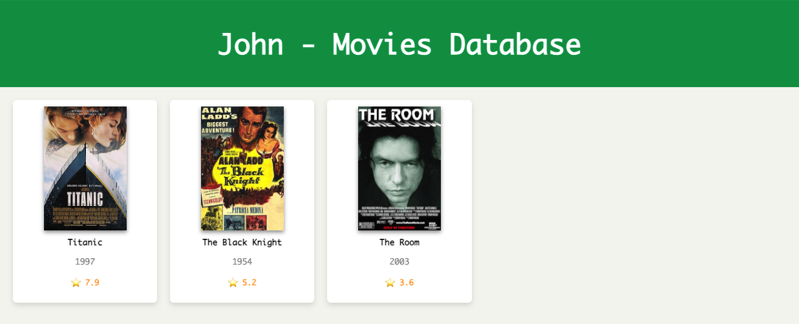

# Movie Storage

A Python-based movie database application with:
- Multi-user profiles
- Persistent storage using **SQLite** and **SQLAlchemy**
- Integration with the **OMDb API** to fetch movie details
- A web generator to display movies in a stylish HTML/CSS website

---

## Features

- **Multi-user support** – each user has their own movie library.
- **Add movies by title only** – year, rating, and poster are fetched from OMDb automatically.
- **Delete movies** – remove movies from your collection.
- **Update movies** – add personal notes to each movie.
- **Stats** – view average and median ratings, as well as best/worst movies.
- **Random movie** – pick a random movie from your collection.
- **Search** – fuzzy search for movies by name.
- **Sorting** – sort by rating or by year (latest first/last).
- **Website generator** – build a personal movie website with posters, ratings, and notes.

---

## Installation

1. Clone the repository:
   ```bash
   git clone https://github.com/Wenz922/movie_storage.git
   cd movie_storage
2. Create a virtual environment:
    ```bash
   python3 -m venv venv
   source venv/bin/activate   # On Windows: venv\Scripts\activate
3. Install dependencies:
    ```bash
   pip install -r requirements.txt
4. Create a `.env` file in the root directory and add your **OMDb API key**:
    ```bash
   API_KEY='your_api_key_here'
   OMDB_API_KEY = API_KEY

---

## Usage

1. Run the application:
   ```bash
   python main.py
2. You’ll see a user (or create a new user) choice:
    ```bash
    Select a user:
   1. John
   2. Sara
   3. Create new user
3. After choosing a user you will see a menu:
    ```bash
   Menu:
   0. Exit
   1. List movies
   2. Add movie
   3. Delete movie
   4. Update movie (add note)
   5. Stats
   6. Random movie
   7. Search movie
   8. Movies sorted by rating
   9. Movies sorted by year
   10. Generate website
   11. Switch user
   
---

## Website Generator
1. When you select **Generate website**, an HTML file is created under `static/` for the active user, e.g.:
    ```bash
    static/John_movies_web.html
2. Open this file in your browser to see your movie collection:
- Movie posters
- Titles & release years
- Ratings
- Notes (shown when hovering over posters)


---

## Dependencies
These are included in `requirements.txt`:
- [requests](https://pypi.org/project/requests/) – API calls  
- [python-dotenv](https://pypi.org/project/python-dotenv/) – load API key from `.env`  
- [colorama](https://pypi.org/project/colorama/) – colored terminal output  
- [SQLAlchemy](https://www.sqlalchemy.org/) – database ORM 

---

## Acknowledgments
- [OMDb API](https://www.omdbapi.com/) for movie data  
- [SQLAlchemy](https://www.sqlalchemy.org/) for database handling  
- [Colorama](https://pypi.org/project/colorama/) for pretty CLI colors  
